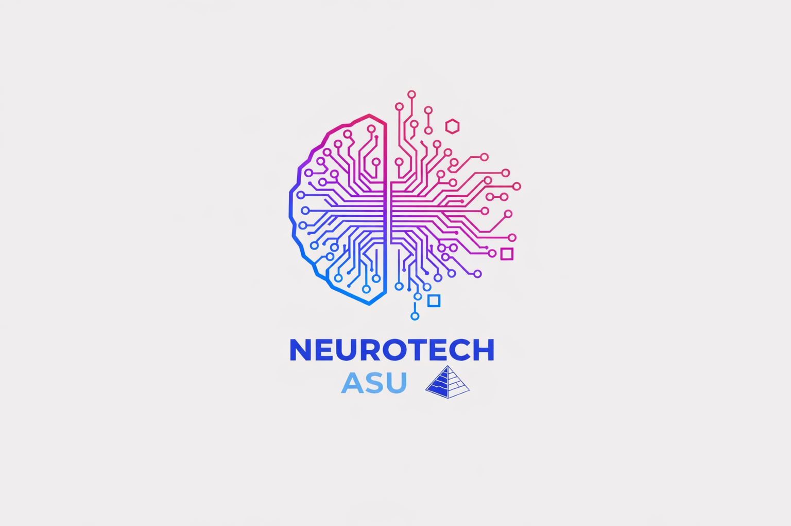

# EEG Emotion Recognition System 🧠

Real-time EEG-based emotion recognition system using g.tec Unicorn Hybrid Black. TSception deep learning, SVM-RBF classifiers, and a Flutter mobile app with native C++/JNI signal processing.

## 🔬 Overview
This project presents an end-to-end Brain-Computer Interface (BCI) for real-time cognitive workload and emotion tracking. Using a g.tec Unicorn Hybrid Black (8-channel EEG at 250Hz), the system acquires neural data, applies digital signal processing, extracts frequency domain features, and classifies valence/arousal using optimized ML and DL models.

## 🏗️ System Architecture

## ⚙️ Signal Processing Pipeline
- **Bandpass Filtering:** 0.5 - 30Hz
- **Notch Filtering:** 50Hz (powerline)
- **Artifact Rejection:** 100µV peak-to-peak thresholding
- **Baseline Correction:** Applied to each epoch

## 🧠 Feature Extraction & Models
Features: Differential Entropy (DE) across 5 frequency bands, DASM, and RASM.

### Models:
1. **SVM-RBF:** Optimized via Optuna hyperparameter tuning. Achieved cross-subject validation **F1=0.87 for valence** and **F1=0.93 for arousal** (LOTO-CV).
2. **TSception:** Temporal-spatial Convolutional Neural Network.
3. **Dual-Stream TSception:** Processes raw and Euclidean Alignment (EA) streams.

## 📱 MindMetric Mobile App
The DSP pipeline is migrated to a Flutter/Android app (`MindMetric`) via native C++/JNI bindings using the `BrainFlow` library for on-device real-time inference.

## 🛠️ Technologies
`Python` `PyTorch` `MNE-Python` `SciPy` `scikit-learn` `BrainFlow` `Optuna` `Flutter` `C/C++` `JNI`
